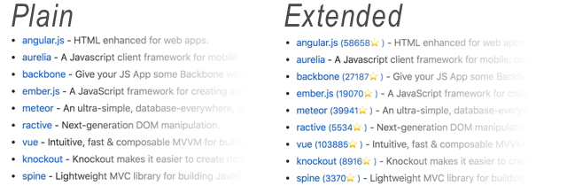

# Sneetches 

A Chrome extension that adds stars to GitHub repo links.

## Installation

Install the extensions from the [Chrome
Store](https://chrome.google.com/webstore/detail/sneetches/kcgocobceakfflhmbolpokembcmeljka).

Or, download this repo, and follow the instructions at [Getting Started Tutorial
&gt; Create the
Manifest](https://developer.chrome.com/extensions/getstarted#manifest), starting
at “The directory holding the manifest file can be added as an extension”.

## Settings

### Access Token

Sneetches uses the [GitHub API](https://developer.github.com/v3/) to retrieve
repository metadata.

Sneetches makes an API call for each GitHub repo it sees in any visited page. It
will therefore quickly exceed the [60 request-per-hour rate
limit](https://developer.github.com/v3/#rate-limiting) for unauthenticated
requests. When this happens, it will display an hourglass after the repo name,
instead of the repo summary statistics.

To increase this limit, create a [GitHub Personal Access
Token](https://help.github.com/articles/creating-a-personal-access-token-for-the-command-line/) by following [this link](https://github.com/settings/tokens/new), and paste this token into the Sneetches options.

If you want Sneetches to add metadata to links to private repositories, give
this token "repo" scope. Otherwise, it doesn't need any scopes.

## Similar Projects

* [Github Hovercard](https://justineo.github.io/github-hovercard/) shows *more* information, on *hover* instead of inline.
* [Lovely Forks](https://github.com/musically-ut/lovely-forks) adds a guess at a project's active fork, beneath its name on the repo page.

## License

MIT
